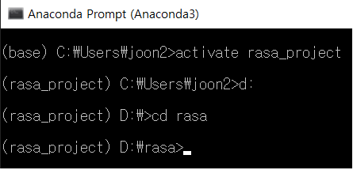
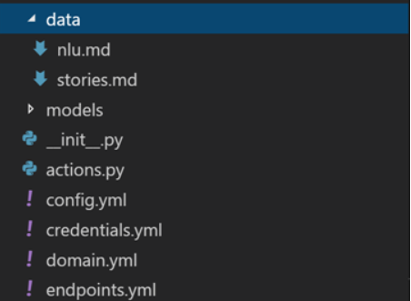
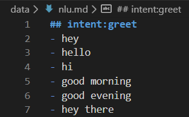
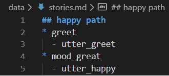
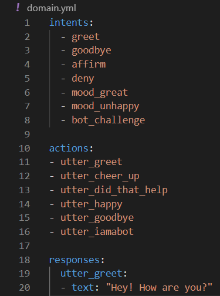
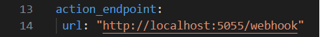
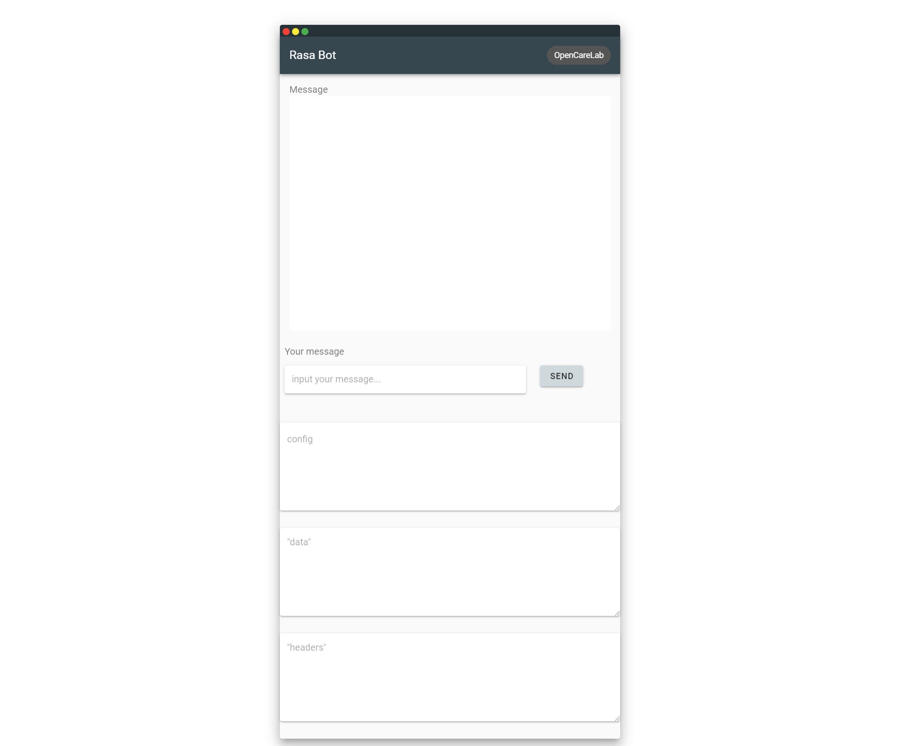
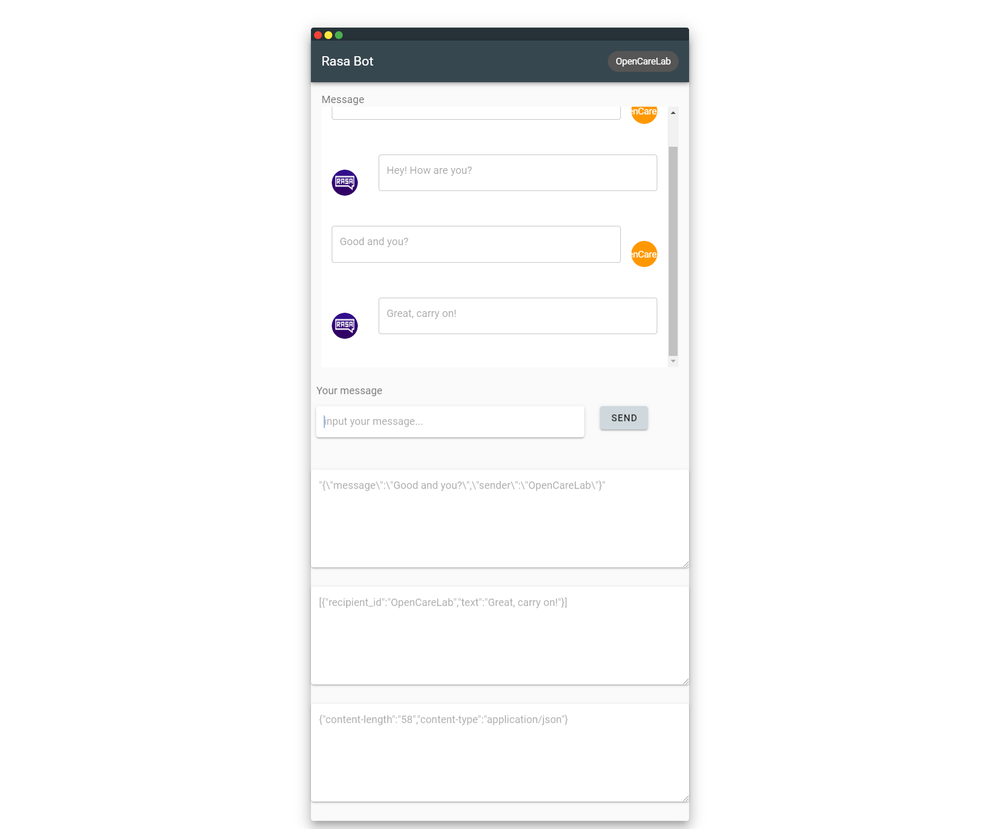
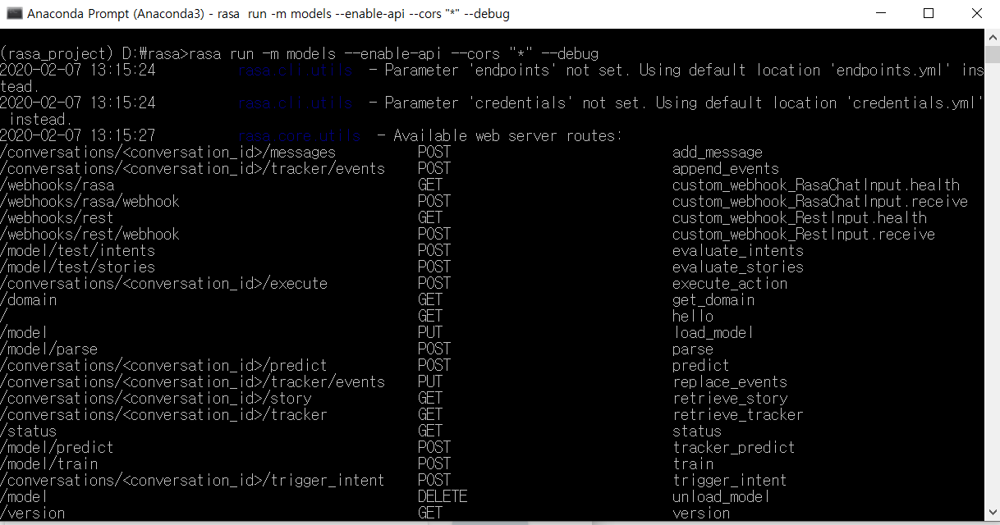

# rasa-Chatbot-vue
- rasa chatbot with vue

# 1. Rasa
## 1.1. Rasa 설치
- 1.1.1. Anaconda 환경 설정
    - rasa_project라는 이름의 Anaconda environment 생성
    - D 드라이브에 rasa directory 생성

- 1.1.2. Rasa 설치
    - pip install rasa
    -> rasa는 python으로 제작된 챗봇 오픈소스로서 수십개 이상의 python 모듈이 함께 설치된다.
    -> 따라서 pip을 최신버전으로 업데이트 후에 설치해야 모듈간 충돌이 나지 않는다!!
- 1.1.3. Rasa project 생성
    - rasa init --no-prompt
    -> 기본적인 mood 예제에 대한 소스코드가 install 된다.


## 1.2. Rasa 구조
- 1.2.1. data
    - 1.2.1.1. nlu.md
        - intent가 저장되어 있으며 각 intent 하단에는 유저가 입력할 수 있는 여러 경우의 문장을 입력한다.

    - 1.2.1.2. stories.md
        - 보통 챗봇과의 대화가 단발성으로 끝나는 것이 아니라 일반 대화처럼 흐름이 존재하므로 여러 intent의 흐름을 명시하는 파일

- 1.2.2. domain.yml
    - stories에서 매칭한 intent에 대한 응답인 utterance를 정의하는 곳이며 각 intent, action(utterance)들을 선언해준다.


## 1.3. Rasa를 api로 사용하기(Webhook)
- 1.3.1. endpoint 설정
    - endpoints.yml 내부에서 action_endpoint를 주석 해제한다.

- 1.3.2. 명령어 실행
    - anaconda로 rasa 폴더에 들어간 뒤 아래 명령어를 실행한다.
    - rasa run -m models --enable-api --cors “*” --debug
- 1.3.3. api post
    - http://localhost:5005/webhooks/rest/webhook 주소로 json을 POST한다.
    - post headers 중 Content-Type: application/json 으로 설정
    - 메시지 형식은 다음과 같다.
```json
{
    "message": [user message],
    "sender": [user name]
}
```

# 2. Chat UI with vue
- Vue cli를 사용하여 프로젝트 create
- vue add vuetify를 사용하여 vuetify를 프로젝트에 추가
- Vuex 도입

## 2.1. 구성 컴포넌트
- 2.1.1. ChatComponent.vue
    - 전체적인 채팅 틀을 잡는 컴포넌트
    - ChatInput, MessageComponent를 사용한다.
- 2.1.2. MessageComponent.vue
    - Chatcomponents 디렉토리 내부에 위치
    - ChatComponent에서 message 내용을 props로 받아 메시지를 출력해줌
- 2.1.3. ChatInput.vue
    - 채팅 입력을 받는 컴포넌트
    - Chatcomponents 디렉토리 내부에 위치
    - 채팅 입력을 받아 Vuex의 messages에 추가
    - axios를 사용하여 Rasa 챗봇과 http통신, 그에 대한 response를 Vuex에 저장하는 역할
- 2.1.4. store.js
    - vuex를 구현한 Javascript 파일
    - state(messages): 사용자가 전송했거나 챗봇으로부터 받은 메시지를 각각 오브젝트 형태로 배열에 저장
    - state(response): 챗봇으로부터 받은 응답을 확인하기 위해 응답 오브젝트를 저장
    - mutation(addMessage): 사용자 입력 혹은 챗봇으로부터 응답이 오면 실행하여 state의 messages를 업데이트
    - mutation(setResponse): 챗봇으로부터 응답을 받으면 state의 response에 그 값을 저장

## 2.2. 실행방법
- D 드라이브 rasa 폴더의 rasachatbot 폴더에 들어가
- npm run serve 실행 후 localhost:8080으로 접속


# 3. 결과 화면
## 3.1. Chat UI with Vue
- 초기 화면

- 채팅 화면

## 3.2. Rasa Api console

